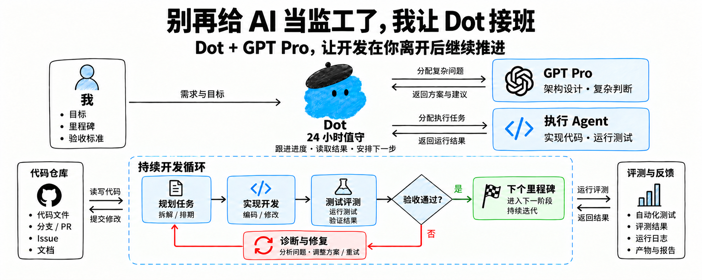
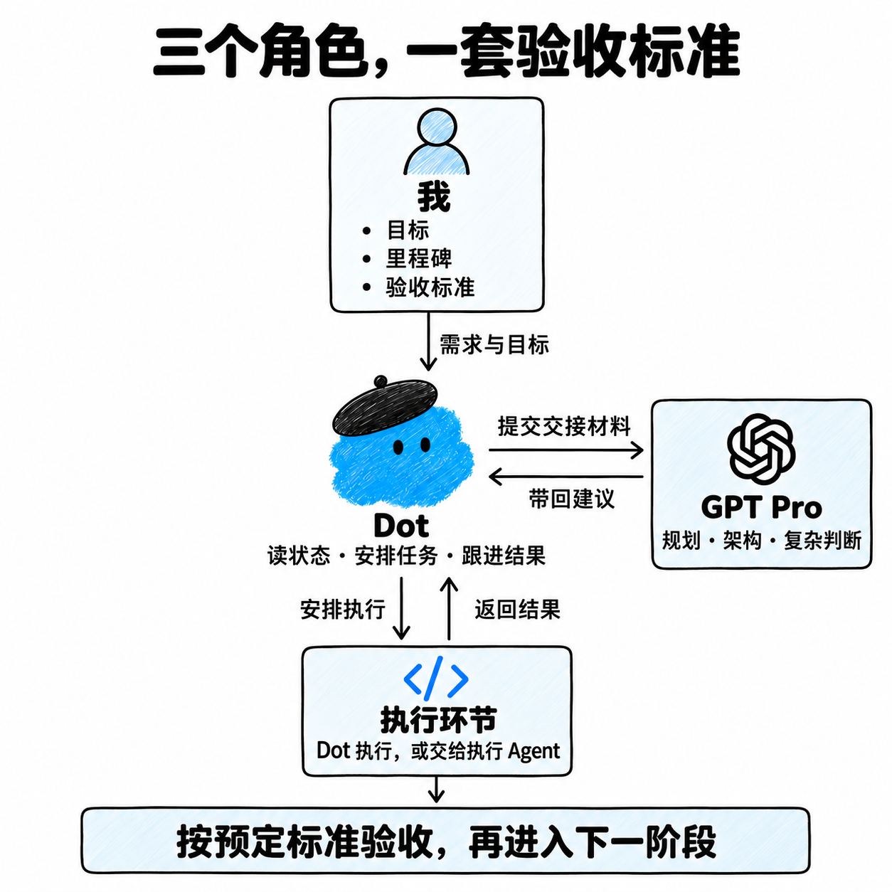
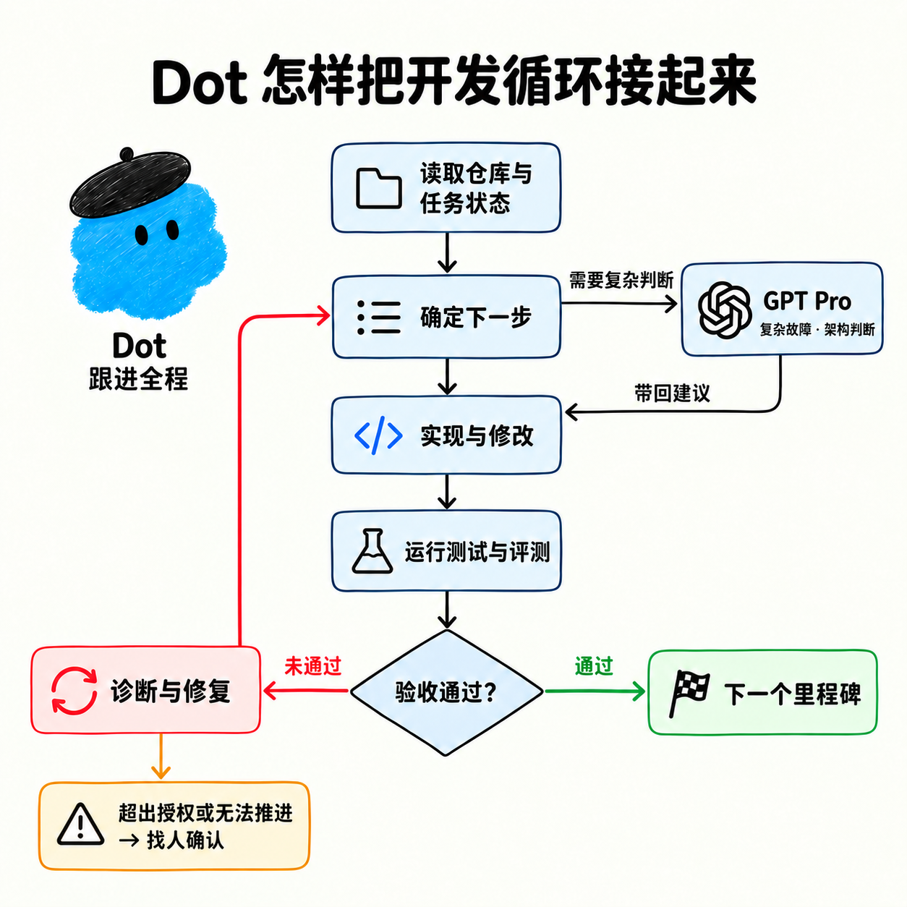

<div align="center">

# Dot × Pro Workflow

**别再给 AI 当监工了，让 Dot 接住下一步。**

Dot 掌握进度 · GPT Pro 共同思考 · 用实际结果推进开发

[开始使用](#开始使用) · [复制任务说明](#给-dot-一份任务说明) · [工作流程](#工作流程) · [技能原文](skills/dot-pro-workflow/SKILL.md)



</div>

一个让 Dot 和 GPT Pro 共同推进开发的轻量 skill。Dot 维护目标、进度和执行上下文，通过你指定的 ChatGPT 项目与 Pro 讨论，把有价值的判断落实到调查、代码、实验和验证中。

你给出目标与边界，Dot 根据任务决定接下来做什么。Pro 可以从一开始就参与目标澄清和方案探索，也可以深入实现、分析实验、提出反例或重新审视方向。讨论的时机、轮数和深度由任务需要决定。

> 图中的“24 小时值守”表达持续跟进的使用方式。实际执行依赖宿主的后台能力、连接状态、权限与额度；安装 skill 不会创建常驻进程或保证全天运行。

## 开始使用

### 1. 准备运行环境

使用前，确认你的 Agent 环境可以：

- 读写目标仓库、运行测试，并访问必要的开发工具。
- 通过已授权的浏览器访问你指定的 ChatGPT 项目，并确认选中了 Pro。
- 读取并遵循 `SKILL.md` 格式的技能指令。

浏览器未登录、项目不可访问或无法确认 Pro 时，skill 要求保留问题包并报告阻塞，不假装已经咨询。不依赖该咨询结果的已授权工作可以继续。

### 2. 加载技能

```bash
git clone https://github.com/Hackerismydream/dot-pro-workflow.git
```

将 [`skills/dot-pro-workflow/`](skills/dot-pro-workflow/) 放入所用环境支持的技能目录，或按该环境的方式导入。具体路径和加载方式由宿主决定；克隆仓库本身不等于安装成功。

加载后先确认 Agent 能找到 `dot-pro-workflow`，再提供下面的任务说明。仓库中没有安装器，也没有额外服务需要启动。

## 给 Dot 一份任务说明

将方括号中的内容换成你的项目情况。已经明确过的授权和约束可以直接引用，不需要每一轮重新确认。

```text
使用 dot-pro-workflow 推进这个项目。

仓库：[路径或仓库链接]
目标：[最终需要交付什么]
当前里程碑：[这一阶段完成什么]
验收标准：[要运行的测试、评测或端到端流程，以及通过条件]

GPT Pro 项目：[我指定的 ChatGPT 项目链接]
我授权你向该项目发送完成本任务所需的脱敏上下文。
不要发送凭据、私密日志或原始会话。

根据任务需要安排调查、讨论、实现和验证，不必套固定顺序。
主动发挥 Pro 在目标澄清、研究、规划、实现推演、评测和复审中的能力。
这些用途不限于架构或排错，也不要求每一步都咨询。
给 Pro 足够的上下文，让它独立判断、质疑假设并提出其他路线。
把新证据带回讨论，再决定实现、实验、追问还是调整方案。

预算与时间上限：[额度、保留量、截止时间]
停止阈值：[何种失败、预算或权限变化需要停止并找我]
代码提交与外部操作权限：[明确允许的操作和范围]

已授权且可执行的下一步继续推进，不必逐步等我说“继续”。
阶段结束时报告改动、实际验证结果和剩余问题。
```

第一次使用，可以先选一个目标明确、验收可运行的小里程碑。确认一次“执行 → 读取结果 → 修复或完成”的流程，再扩大范围。

## 工作流程

Dot 始终掌握三件事：**目标是什么、现在知道什么、下一步怎样推进。** 它可以自己实现、借助已有执行 Agent，也可以进入指定项目与 Pro 深入讨论。Pro 的回复会回到真实仓库和实验中接受检验，新结果再成为下一轮思考的上下文。

没有必经的五步流程。下面是几种可能的推进方式，不是分支规则或用途限制：

| 当前情况 | 一种合理的推进方式 |
| --- | --- |
| 目标开放，路线还没想清楚 | 先与 Pro 澄清问题、比较路线，再决定需要哪些调查或实验 |
| 已有明确、局部的修改 | Dot 直接实现和验证；发现值得讨论的问题再引入 Pro |
| 关键实现需要深入推演 | 提供相关代码，请 Pro 推导算法、给实现草案或设计反例，Dot 落实验证 |
| 实验结果与预期不一致 | 带着结果和假设共同分析，补证据、修实现或重新考虑方案 |
| 一个阶段结束 | 按目标检查证据，需要时请 Pro 复审，并重新判断下一阶段的优先级 |

讨论可以先于代码，也可以穿插在实现中。一次有效讨论可能带来新方案，也可能发现原目标需要澄清；不要求每次答复都变成一个代码任务。

<details>
<summary><strong>查看分工图</strong></summary>



图示用于说明协作关系，其中列出的 Pro 用途只是例子。执行 Agent 是可选方式，是否能调度取决于宿主能力，Dot 也可以自己完成实现和验证。

</details>

<details>
<summary><strong>查看开发循环图</strong></summary>



这张图展示一个常见循环，不规定必经顺序；Pro 可以参与任何有价值的思考环节。

</details>

## 怎样用好 GPT Pro

可以让 Pro 帮你澄清目标、研究问题、规划整体路线、推演算法与实现、设计测试、分析失败、审查方案，或解释实验结果。不要等卡住了才想到它，也不用事先把它限制为某一种专家。

**上下文给足，答案保持开放。** 带上真实目标、相关代码、已有证据、未确认的假设和用户约束；不要只给一个预设方案让 Pro 点头。允许它反驳当前判断、提出未列出的路线，并按问题需要深入推演。

比如：“这是我们的目标、当前实现和失败记录。请先独立判断问题是否定义正确，再给出你认为值得验证的路线。现有方案可以推翻，但这些用户约束需要保留。”

同一问题的讨论尽量连续，实施结果及时带回原会话。咨询是否继续，看它能否带来新证据、新方案或更清楚的判断，不以固定轮数或“每步必须问一次”为准。真实授权和预算仍然有效。

## 完成，必须有验证结果

交付时应能看到：

- **改动**：实际实现了什么，对应哪些文件或产物。
- **验证**：运行了哪些检查，结果如何，哪些未执行。
- **剩余问题**：尚未满足的条件、阻塞证据和恢复方式。

阶段标准可以是测试通过、指定 Eval 达标，或关键业务流程真实走通。由任务本身决定，不要求每个小修都跑一套无关检查。

## 使用边界

- 本仓库提供工作流指令，不提供模型、浏览器权限、免费额度或后台调度服务。
- 复用用户已有授权；咨询 Pro 不会自动扩大代码操作、合并、部署、付费或凭据权限。
- 预算不可确认时说明不确定性，不把未知额度当成可用额度，也不动用用户保留量。
- 发送状态不确定时先核对原会话，避免重复提交；中断后结合工作记录、仓库和会话状态恢复。
- 用户要求暂停、达到预算阈值或验收完成时，停止相应工作。

完整执行规则以 [`SKILL.md`](skills/dot-pro-workflow/SKILL.md) 为准。README 和配图用于说明方法，不代表已经完成安装、真实 Pro 咨询或长期运行验证。
